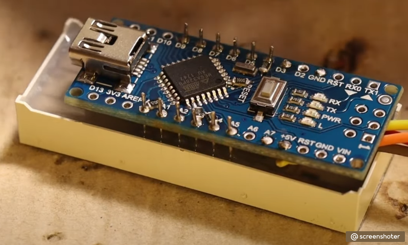
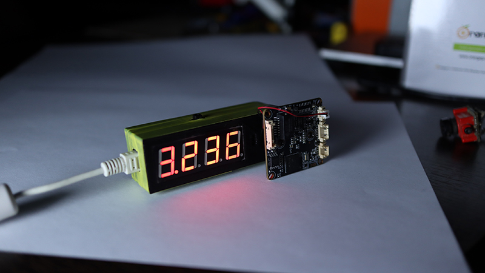

# Latency Meter Camera

Устройство для измерения раздержки различных камер и FPV-систем. Оно построено на плате Ардуино Нано и 4х разрядном 7ми-сегментном индиаторе LED 5461AS-1.

**Кнопка:** Длинное нажатие на кнопку запускает процесс измерения сначала. Короткое - переключает показания индикатора между real-time, min, max, sma.

Видео по сборке: [https://www.youtube.com/watch?v=69uGeqPZ3CI](https://www.youtube.com/watch?v=69uGeqPZ3CI)

